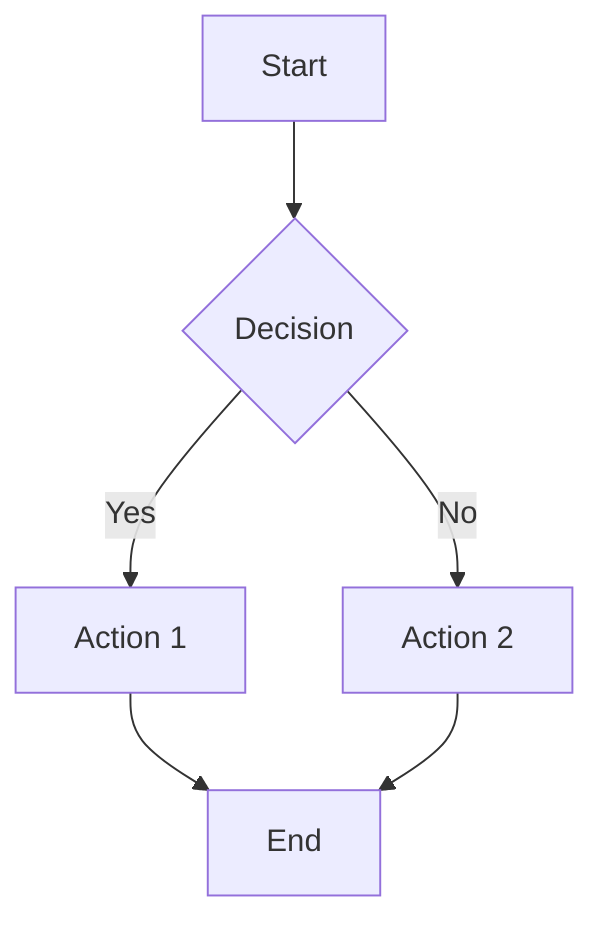

# Mermaid Diagram Skill

## Mission

Create and edit Mermaid (`.mmd`) text-based diagrams for BrainXio documentation.

## When Dispatched

- Flowcharts for decision trees
- Sequence diagrams for API interactions
- Class diagrams for code structure
- State diagrams for lifecycle docs
- Gantt charts for timelines

## Mermaid Workflow

### Step 1: Check Existing Diagrams

```bash
# List available mermaid diagrams
ls -la docs/diagrams/mermaid/
```

### Step 2: Create Diagram Source

Mermaid files use `.mmd` extension. Example:



### Step 3: Store in Mermaid Directory

```bash
mkdir -p docs/diagrams/mermaid
cat > docs/diagrams/mermaid/auth-flow.mmd << 'EOF'
sequenceDiagram
    participant U as User
    participant A as Auth Service
    participant D as Database
    U->>A: Login request
    A->>D: Validate credentials
    D-->>A: User record
    A-->>U: JWT token
EOF
```

### Step 4: Embed in Markdown

GitHub and most markdown renderers support Mermaid natively:

````markdown
```mermaid
{{ include "../diagrams/mermaid/auth-flow.mmd" }}
```
````

Or paste the diagram directly in the markdown file.

### Step 5: Validate Syntax

```bash
# Use mermaid-cli to validate
docker run -v $(pwd):/data minlag/mermaid-cli -i docs/diagrams/mermaid/auth-flow.mmd -o /tmp/test.png
```

## Diagram Types

| Type              | Use Case                     | Example                 |
| ----------------- | ---------------------------- | ----------------------- |
| `graph`           | Flowcharts, decision trees   | `auth-flow.mmd`         |
| `sequenceDiagram` | API interactions, messaging  | `bus-communication.mmd` |
| `classDiagram`    | Code structure, types        | `agents-core-types.mmd` |
| `stateDiagram`    | Lifecycle, state machines    | `session-lifecycle.mmd` |
| `gantt`           | Timelines, project schedules | `sprint-timeline.mmd`   |
| `erDiagram`       | Data models, schemas         | `bus-schema.mmd`        |

## Naming Convention

- Use kebab-case: `auth-flow.mmd`, `bus-architecture.mmd`
- Prefix with component: `agents-core-types.mmd`

## Anti-patterns

- **Over-complex graphs** — Split into multiple diagrams if >20 nodes
- **No labels** — All nodes and edges should be self-explanatory
- **Inconsistent direction** — Use `graph TD` (top-down) consistently
- **Duplicate diagrams** — Check existing diagrams before creating new ones

## Related

- `skills/diag-drawio/SKILL.md` — DrawIO visual diagrams
- `docs/diagrams/README.md` — Diagrams repository structure
